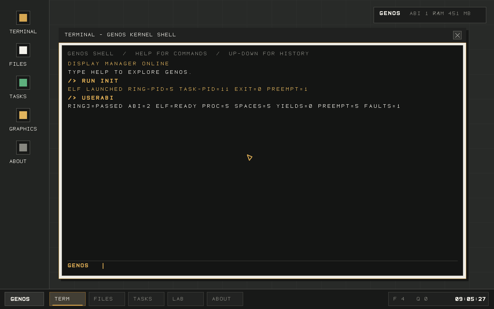

# GenOS

**A small, understandable operating system built to become fast, focused, and genuinely pleasant to use.**

[](https://github.com/ErzenXz/GenOS/actions/workflows/ci.yml)
[](LICENSE)
[](#build-and-run)
[](#project-status)



GenOS is a from-scratch `x86_64` operating system written in Rust. It boots through its own UEFI loader, enters a `no_std` kernel, initializes memory and interrupts, and opens a native framebuffer desktop with keyboard, mouse, filesystem, task, clock, and window-management support.

The long-term goal is ambitious: build an operating system that feels lighter than Windows, more coherent than a typical desktop Linux installation, and simple enough that a curious developer can understand the path from power-on to pixel.

GenOS is **not a Linux distribution** and does not use the Linux kernel. It is also not ready to replace a daily-driver operating system today. The current release is an experimental foundation designed to grow in public.

## Why GenOS?

Modern operating systems are extraordinarily capable, but decades of compatibility requirements, layered abstractions, duplicated services, and product compromises have made them difficult to understand and expensive to change.

GenOS starts from a smaller set of principles:

- **Small before clever.** Every subsystem should justify its complexity.
- **One coherent product.** Kernel, desktop, applications, and developer tooling should evolve together.
- **Fast by construction.** Avoid unnecessary background work, copies, allocations, and abstraction layers.
- **Understandable internals.** A contributor should be able to trace an input event or rendered frame without crossing dozens of repositories.
- **Safe foundations.** Rust removes broad classes of memory errors while still allowing precise low-level control.
- **Useful progress.** Each milestone should produce something observable, testable, and worth demonstrating.
- **Honest scope.** GenOS will earn capability through measured milestones instead of pretending an experiment is already production-ready.

## What are we trying to improve?

GenOS is inspired by the strengths of Windows, Linux, macOS, BSD, and research operating systems. It is not built around insulting those projects; it is built around learning from the trade-offs they expose.

### Where Windows can feel heavy

Windows carries an enormous compatibility contract across hardware generations, enterprise environments, application models, and decades of software. That strength also creates visible costs:

- large background-service and update footprints;
- inconsistent interfaces produced by multiple generations of system UI;
- opaque system activity that can be difficult to explain or control;
- a growing baseline for memory, storage, and hardware requirements;
- product decisions that do not always align with a user's desire for a quiet, local-first computer.

GenOS explores the opposite starting point: a small baseline, explicit system activity, and a desktop built alongside the kernel rather than layered over decades of compatibility.

### Where desktop Linux can feel fragmented

Linux offers extraordinary freedom, performance, hardware reach, and engineering quality. Its modular ecosystem is also its defining desktop challenge:

- distributions, package formats, desktop environments, display stacks, and configuration models can diverge;
- polished behavior may depend on integration work spread across many independent projects;
- common desktop tasks sometimes require knowledge of the underlying system;
- application distribution and hardware support can vary significantly between installations;
- there is no single product team responsible for the entire user experience.

GenOS keeps the openness and inspectability, but aims for a single reference system with one documented application model, one visual language, and one release path.

### The GenOS bet

The bet is that a focused system can eventually deliver:

1. a very small, measurable resource baseline;
2. predictable behavior with fewer invisible services;
3. a coherent desktop and application platform;
4. strong isolation without making the system impossible to understand;
5. an approachable codebase that helps new systems programmers learn and contribute.

That outcome will take years of careful work. This repository is the starting point.

## What works today

The current GenOS build already contains real operating-system infrastructure:

- repo-owned `x86_64` UEFI bootloader;
- ELF kernel loading and versioned boot information;
- Rust `no_std` kernel with GDT, TSS, IDT, and interrupt setup;
- gap-safe physical frame allocation that keeps reserved firmware ranges out of circulation;
- cloned supervisor-only kernel page tables with explicitly exposed user code and stack pages;
- three ring-3 process instances with separate CR3 roots and private code, data, guard, and stack mappings;
- timer-driven CPU preemption with saved contexts, address-space switching, and resume;
- process-local user page-fault termination that leaves healthy processes and the kernel running;
- a bounded ELF64 parser and W^X userspace segment loader;
- a separately built `no_std` userspace runtime and `INIT.ELF` application packaged in the initrd;
- boot-time and shell-triggered ELF launches, each receiving a fresh address space;
- a DPL3 `int 0x80` syscall gate with scalar and user-buffer validation before copy-in;
- PS/2 keyboard and mouse input with an event queue;
- Shift, Caps Lock, symbols, and shell command history;
- backbuffered framebuffer rendering and dirty-region presentation;
- native desktop, taskbar, start panel, cursor, and draggable windows;
- bounded kernel-worker lifecycle with PIDs, protected system tasks, and slot reuse;
- round-robin scheduling with measured CPU slices, sleep/wake deadlines, and context-switch accounting;
- writable RAM-backed virtual filesystem;
- Files application backed by live VFS state;
- Task Manager backed by the kernel task registry;
- RTC date and clock support;
- graphics/backbuffer demonstration surface;
- serial boot diagnostics and long-running QEMU smoke tests.

The build has no host operating-system runtime underneath it. QEMU provides virtual hardware, but the bootloader, kernel, input path, filesystem, task model, drawing, and desktop behavior are GenOS code.

## Desktop controls

| Action | Control |
| --- | --- |
| Open or focus an application | Click its desktop or taskbar entry |
| Move a window | Drag its title bar |
| Close the active window | Click the close control or press `Escape` |
| Switch between open applications | Press `Tab` |
| Recall terminal commands | Press `Up` or `Down` |
| List shell commands | Run `help` |

The shell includes filesystem commands such as `ls`, `cat`, `touch`, `write`, `append`, `mkdir`, `rm`, and `stat`. Process controls include `ps`, `run init`, `spawn NAME`, `kill PID`, `sleep PID TICKS`, `wake PID`, and `sched`; `userabi` reports the live ELF, ring-3, and syscall state. Worker names accept 1–12 letters, numbers, hyphens, or underscores.

GenOS 0.9 builds `genos-init` independently from the kernel, packages it as `INIT.ELF`, validates its ELF64 headers and load segments, and maps RX text and RW data into a fresh process root. The boot proof runs four ELF-backed instances while preserving timer preemption and local fault containment. `run init` launches another instance from the desktop shell, waits for its validated exit, records it in the task registry, and returns to the desktop. Launch is currently synchronous; general asynchronous process control remains Stage 2 work. See [the userspace boundary notes](docs/USERSPACE.md) for exact guarantees and limitations.

## Architecture

```text
UEFI firmware
    |
    v
GenOS bootloader
    |  loads kernel ELF + initrd
    v
GenOS kernel
    |-- architecture setup       GDT / TSS / IDT / IRQ
    |-- memory                   gap-safe frames / protected page tables
    |-- ELF loader              bounded parser / W^X segment mapping
    |-- userspace               runtime / private CR3 / preemption / local faults
    |-- input                    PS/2 keyboard + mouse / event queue
    |-- storage                  initrd + writable RAM VFS
    |-- tasks                    registry / state / accounting
    |-- display                  backbuffer / dirty regions / text
    `-- desktop                  windows / apps / taskbar / shell
```

The system remains intentionally monolithic while its contracts are established, but the first hardware-enforced user/kernel boundary is now working. It is a boot-time proof, not yet a general application runtime.

## Project status

GenOS is an **experimental developer preview**.

It is suitable for:

- learning about UEFI and kernel development;
- experimenting with low-level Rust;
- contributing to an early operating-system architecture;
- testing desktop and graphics ideas in a controlled environment.

It is not yet suitable for:

- storing important or persistent data;
- running existing Windows or Linux applications;
- daily-driver desktop use;
- deployment on untested physical hardware;
- environments requiring a mature security model.

See [ROADMAP.md](ROADMAP.md) for milestone definitions, acceptance criteria, and the path toward userspace, persistent storage, networking, security, and an application ecosystem.

## Build and run

### Requirements

- Rust 1.93 or newer
- `x86_64-unknown-uefi` and `x86_64-unknown-none` Rust targets
- QEMU with EDK2/OVMF firmware
- `mtools`

On macOS with Homebrew:

```sh
brew install qemu mtools
rustup target add x86_64-unknown-uefi x86_64-unknown-none
```

On Ubuntu or Debian:

```sh
sudo apt-get install qemu-system-x86 ovmf mtools
rustup target add x86_64-unknown-uefi x86_64-unknown-none
```

### Commands

```sh
# Build the bootable disk image at build/genos.img
make build

# Boot GenOS in QEMU
make run

# Run unit tests, rebuild, and execute the long-lived QEMU smoke test
make test

# Remove generated build artifacts
make clean
```

A successful boot writes `GENOS_READY` to the serial console and opens the framebuffer desktop.

## Repository layout

```text
bootloader/       UEFI loader and ELF loading
crates/abi/       Versioned bootloader-kernel contract
kernel/           no_std kernel, hardware, filesystem, and desktop
userspace/         no_std runtime and independently linked ELF application
tools/xtask/      Build image, initrd, QEMU, and smoke-test automation
.github/          CI and contribution workflows
```

## Roadmap at a glance

- [x] **Foundation:** UEFI boot, kernel entry, framebuffer, serial diagnostics
- [x] **Interactive desktop:** input, windows, shell, RAM filesystem, live task UI
- [ ] **Processes and userspace (in progress):** private address spaces, Ring 3, validated copy-in, preemption, local faults, ELF loading, and shell launch work; asynchronous lifecycle control comes next
- [ ] **Persistent storage:** block drivers, partition discovery, durable filesystem
- [ ] **Networking:** device driver, Ethernet, ARP, IPv4, UDP, TCP, DNS
- [ ] **Security model:** identities, capabilities, isolation, secure update design
- [ ] **Application platform:** stable SDK, packages, compositor, richer graphics
- [ ] **Hardware expansion:** ACPI, SMP, USB, NVMe, audio, broader GPU support

Progress is accepted through working code and measurable criteria, not roadmap labels alone. The detailed plan lives in [ROADMAP.md](ROADMAP.md).

## Performance philosophy

“Lightweight” needs numbers. As GenOS grows, the project will publish and track:

- boot time to usable desktop;
- idle memory footprint;
- idle wakeups and CPU time;
- input-to-frame latency;
- binary and disk-image size;
- filesystem and network throughput;
- regression budgets for every release.

The project will prefer evidence over claims. GenOS should only call itself faster or lighter when repeatable benchmarks demonstrate it.

## Contributing

GenOS is early enough that thoughtful contributors can still shape its architecture.

Good first areas include tests, documentation, shell ergonomics, framebuffer primitives, filesystem correctness, build portability, and hardware emulation coverage. Larger changes to scheduling, userspace, storage, networking, or the application ABI should begin with an issue describing the contract and migration path.

Read [CONTRIBUTING.md](CONTRIBUTING.md) before opening a pull request. Please follow the [Code of Conduct](CODE_OF_CONDUCT.md) and report security concerns through the process in [SECURITY.md](SECURITY.md).

## Principles for pull requests

- Keep the system bootable after every change.
- Prefer a small complete subsystem over a broad placeholder.
- Add a serial marker or test when introducing a boot-critical path.
- Explain unsafe code and keep its scope narrow.
- Do not hide major architectural decisions inside unrelated patches.
- Preserve the `no_std` kernel boundary.
- Measure performance-sensitive changes.

## License

GenOS is released under the [MIT License](LICENSE).

## A note on the ambition

Could GenOS become lighter and more coherent than today's mainstream systems? Yes—that is the reason to build it.

Is it already “better than Linux” or ready to replace Windows? No. Linux and Windows represent decades of engineering across thousands of devices and workloads. GenOS will respect that reality, learn in public, and compete one proven milestone at a time.

If that mission sounds worthwhile, build it, test it, challenge the design, and help move the roadmap forward.
